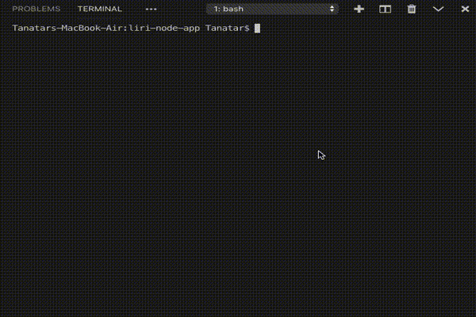
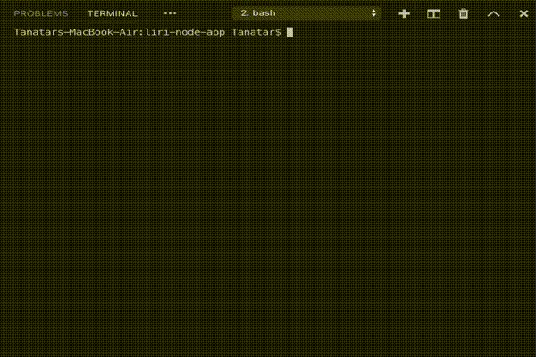
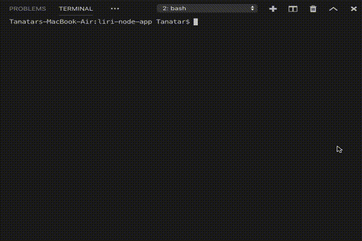
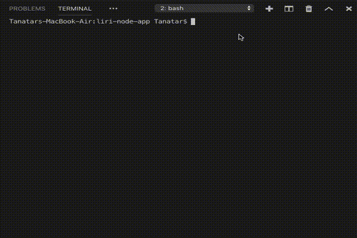

# LIRI-node-app

If you a looking for node app that will make your life easier with searching songs from Spotify or finding more information about your selected movie or to see the schedule of your bands concerts, go a head and enjoy my LIRI-node-app. 

### ABOUT

LIRI is like iPhone's SIRI. However, while SIRI is a Speech Interpretation and Recognition Interface, LIRI is a _Language_ Interpretation and Recognition Interface. LIRI will be a command line node app that takes in parameters and gives you back data.

### INSTRUCTIONS

* First you need to install and declare your modules

```javascript
require("dotenv").config();
let keys = require("./keys");
let axios = require("axios");
let Spotify = require("node-spotify-api");
let moment = require("moment");
let fs = require("fs");
let spotify = new Spotify(keys.spotify);
```


1. SEARCH CONCERTS

please run the following code on your terminal window:

```
node liri.js concert-this <YOUR_BAND_NAME>
```

EXAMPLE:



RESPONSIBLE CODE:

```javascript
// CONCERT-THIS

let getBand = function (artist) {
    let URL = "https://rest.bandsintown.com/artists/" + artist + "/events?app_id=codingbootcamp";
    axios.get(URL).then(
        function (response) {
            if (!response.data.length) { console.log("Not found"); return }
            console.log("Concerts for " + artist + ":");
            response.data.forEach((event) => {
                console.log(
                    event.venue.name + " in " +
                    event.venue.city + "," +
                    event.venue.country + " " +
                    moment(event.datetime).format("MM/DD/YYYY") +
                    "\n"
                );
            }
            )
        }
    );
};

if (process.argv[2] === "concert-this") {
    getBand(process.argv[3]);
};
```


2. SEARCH SONGS on SPOTIFY

please run the following code on your terminal window:

```
node liri.js spotify-this-song <YOUR_SONG>
```

EXAMPLE:



RESPONSIBLE CODE:

```javascript
// SPOTIFY-THIS-SONG

// additional func for artist name map()
let getArtistName = artist => { return artist.name };

//search function
let searchSong = (songName) => {
    if (songName === undefined) { songName = "The Sign"; }
    spotify
        .search({ type: 'track', query: songName, limit: 5 })
        .then(function (response) {
            let songs = response.tracks.items;

            songs.forEach((song) => {
                console.log(
                    `Artist(s): ${song.artists.map(getArtistName)}
Song name: ${song.name}
Preview: ${song.preview_url}
Album: ${song.album.name}
==============================`)
            });
        })
        .catch(function (err) {
            console.log(err);
        });

}
if (process.argv[2] === "spotify-this-song") {
    searchSong(process.argv[3]);
};
```


3. SEARCH MOVIES

please run the following code on your terminal window:

```
node liri.js movie-this <YOUR_MOVIE>
```

EXAMPLE:



RESPONSIBLE CODE:

```javascript
// MOVIE-THIS

let getMovie = (search) => {
    if (search === undefined) { search = "Mr Nobody"; }
    let url = "http://www.omdbapi.com/?t=" + search + "&y=&plot=full&tomatoes=true&apikey=trilogy";
    axios.get(url).then(
        function (response) {
            console.log("TITLE: " + response.data.Title);
            console.log("YEAR: " + response.data.Year);
            console.log("IMDB RATING: " + response.data.imdbRating);
            console.log("RT RATING: " + response.data.Ratings[1].Value);
            console.log("COUNTRY: " + response.data.Country);
            console.log("LANGUAGE: " + response.data.Language);
            console.log("PLOT: " + response.data.Plot);
            console.log("ACTORS: " + response.data.Actors);
        }
    );
};

if (process.argv[2] === "movie-this") {
    getMovie(process.argv[3]);
};
```


3. SEARCH through FILE

please run the following code on your terminal window:

```
node liri.js do-what-it-says
```

EXAMPLE:



RESPONSIBLE CODE:

```javascript
// DO-WHAT-IT-SAYS

let doWhatItSays = () => {
    fs.readFile("random.txt", "utf8", (err, data) => {
        if (err) return err;
        let arr = data.split(",");
        searchSong(arr[1]);
    });
};

if (process.argv[2] === "do-what-it-says") {
    doWhatItSays();
};
```

